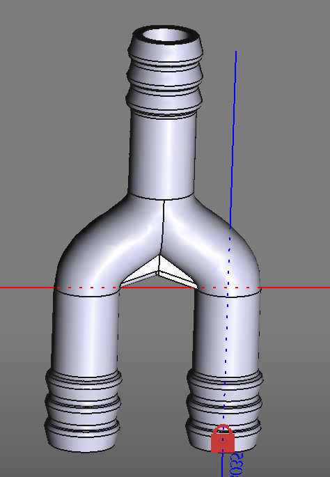
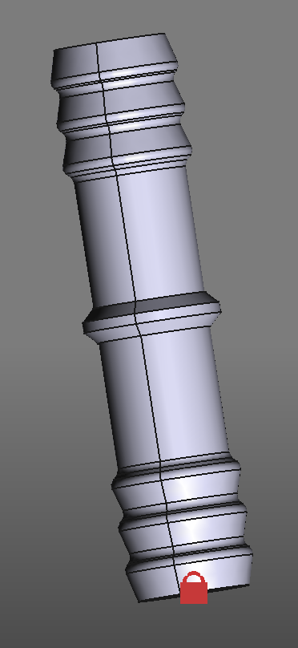

# FreeCad-HoseStuff

Collection of work in progress 3d-printable hose connectors for my 1/2" watering system.
Trying to design the parts so that I can print with minimal support.
Currently experimenting with TPU since the PLA is a bit to britle to survive the real world.

## Splitter

## Extension

